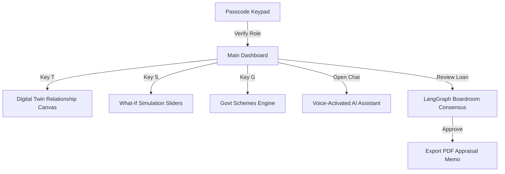

# GramOS Master Specification Document

Welcome to the Master Specification for **GramOS** (RuralOS) - the AI-powered financial intelligence platform designed to close India's rural credit gap. This document details the product vision, architecture, modules, design system, machine learning pipelines, coding standards, and developmental roadmaps.

---

## PART 1 — Product Vision, Philosophy, & Features

### 1. Product Vision
GramOS is an AI-powered financial operating system designed to close the ₹8.5 Lakh Crore rural credit gap in India. By establishing a robust digital credit footprint without traditional collateral, it empowers smallholder farmers, dairy operators, Self-Help Groups (SHGs), and Farmer Producer Organizations (FPOs) to access institutional credit and subvented government schemes.

### 2. Philosophy
Rural credit underwriting has traditionally been hampered by lack of formal records, structural cash flow volatility, and geographical barriers. GramOS flips this constraint by using **alternative credit metrics** (e.g., milk cooperative ledger entries, satellite vegetation greenness index checks, transaction history sweeps) to model a rural business’s health dynamically and generate explainable AI risk assessments.

### 3. Design Principles
- **Data Density**: Display rich data cards and metrics clearly, utilizing the screen real estate to provide a boardroom-level or cockpit-style overview.
- **Visual Sophistication**: Emulate top-tier fintech interfaces like Stripe, CRED, and Mercury. Avoid basic templates; use curated dark-mode palettes, smooth glassmorphic containers, and vibrant indicators.
- **Tactile Feedback**: Utilize physical simulation indicators (like credit cards and keypads) to create high trust and tangibility.

### 4. UX Principles
- **Contextual Simplicity**: Provide deep tools but wrap them in accessible entry points (e.g., PIN keypads for local operators).
- **Voice-First Integration**: Enable conversational local-language search interfaces for users with low keyboard literacy.
- **Shortcut Driven**: Bind global keyboard event listeners (like `[D]`, `[T]`, `[S]`, `[G]`) for lightning-fast dashboard switching.

### 5. AI Principles
- **Consensus-Driven Agent Debates**: Underwrite using a boardroom model. Rather than outputting a single opaque credit score, multiple specialized agents (CFO Agent, Climate Risk Agent, Fraud Investigator Agent) debate key points to form a transparent consensus.
- **Explainability (SHAP & Feature Importance)**: Ensure every machine learning prediction lists the top factors driving it, so credit officers can justify decisions.

### 6. Rural Finance Principles
- **Seasonality Stress Testing**: Cash flow models must account for harvest/milking cycles rather than assuming linear monthly returns.
- **Subvention Scheme Matching**: Match entrepreneurs directly to active state and central programs (like PMEGP, Mudra, AHIDF) to reduce financing costs.

### 7. Product Goals
- Reduce underwriting processing duration from 45 days to under 10 minutes.
- Project and maintain default rates under 2.8% using satellite greenness indices.
- Paperless ledger appraisal to cut administrative lending expenses by 85%.

### 8. User Personas
- **Rural Entrepreneur (e.g., Ramesh, Sunita, Vignesh)**: Dairy owners, farmers, and weavers looking to check credit eligibility and schemes.
- **Field Officer (e.g., NABARD Officer)**: Audits local applicant twins, inspects crop health, and reviews risk flags in rural districts.
- **Bank Credit Officer**: Audits boardroom debates, reviews ledger fraud flags, and generates formal credit memos.

### 9. User Journey
1. **Gate Entry**: Operator inputs a 4-digit passcode on a tactile secure gate.
2. **Dashboard Overview**: Inspects the financial digital twin, cash flows, and NDVI maps.
3. **What-If Simulation**: Drags crop yield, feed cost, and milk price sliders to stress-test cash flows.
4. **Agent Debate Boardroom**: Bank officer reviews the CFO, Climate, and Fraud agents' debate.
5. **Credit Memo Generation**: Generates and prints a paperless credit memo.

### 10. Complete Feature List
- **Visual Digital Twin Canvas**: Interactive flow chart connecting assets, transactions, and risk scores.
- **What-If Cash Flow Stress Tester**: Slider-driven simulation engine.
- **AI Boardroom Console**: Live consensus orchestration and node debate graph.
- **NDVI Climate Watch**: Live satellite greenness indices map tracker.
- **Govt Schemes Catalog**: Real-time matching tool for subvention schemes.
- **OCR Secure Vault**: Document upload, OCR parsing, and fraud risk flags.
- **Voice AI Drawer**: Local-language voice assistant explaining platform features.
- **Keyboard Fast Navigation**: Direct keybind bindings for rapid view shifts.

---

## PART 2 — Information Architecture, UX, & Design System

### 11. Information Architecture
The platform is organized into three major user-role perspectives:
- **Entrepreneur Portal**: Focuses on cash flow projections, digital twin visualization, and schemes.
- **Field Inspector Console**: Emphasizes NDVI crop indices, local risk anomalies, and document uploads.
- **Bank Officer Boardroom**: Provides the LangGraph agent debate panel, alternative credit radar, and credit memo export.

### 12. Navigation
Navigation uses a layout with a high-contrast sidebar, keyboard shortcut hints, and a global view switcher:
- **`[D]`**: Dashboard Overview
- **`[T]`**: Digital Twin Visualization
- **`[S]`**: What-If Scenario Stress-Testing
- **`[G]`**: Govt Schemes Hub

### 13. User Flows


### 14. Design System
- **Backgrounds**: Deep Pitch-Black (`#020202`) and slate finishes.
- **Card Styling**: Semi-transparent glass panels using `border-white/[0.04]` with subtle neon border glows.
- **Colors**:
  - **Primary**: Emerald Green (`#10b981`) for normal states and approvals.
  - **Secondary**: Teal (`#14b8a6`) for cash flow stability.
  - **Accent**: Gold (`#eab308`) for premium indicators.
  - **Risk Red**: Crimson (`#ef4444`) for critical anomalies.

### 15. Components
Reusable design primitives:
- [GlassCard](file:///d:/GramOS/src/components/ui/GlassCard.tsx): Styled card container with grid backing and border.
- [Button](file:///d:/GramOS/src/components/ui/Button.tsx): Emerald-teal hover action buttons.
- `MetricCard`: Features key indicator status, trend delta, and background radial glows.

### 16. Motion System
Implemented via Framer Motion:
- Layout view transitions slide in from the bottom with spring physics.
- Node relationships in the digital twin canvas pulse dynamically.
- Slider scenarios cause instant, animated updates to the Recharts area graphs.

### 17. Accessibility
- High contrast dark-mode ratios (greater than 7:1 for text).
- Full keyboard-traversable input panels.
- Semantic HTML landmarks (`<nav>`, `<main>`, `<section>`).

### 18. Responsive Rules
- Adaptive Grid Columns: 1 column on mobile, 2 columns on tablet, 3-4 columns on desktop layouts.
- Auto-collapsing sidebar to slide drawer on screens under 1024px.

---

## PART 3 — Architecture, Database, & Core Logic

### 19. Frontend Architecture
Built with **React 18**, **TypeScript**, and **Vite 8** for lightning-fast Hot Module Replacement (HMR).
Key files:
- [App.tsx](file:///d:/GramOS/src/App.tsx): Root layout orchestrating routes, key events, and visual dashboards.
- [api.ts](file:///d:/GramOS/src/services/api.ts): Backend endpoint integration connector.

### 20. Backend Architecture
Implemented via **FastAPI** to support asynchronous database reads and concurrent ML predictions.
Key files:
- [run.py](file:///d:/GramOS/backend/run.py): Main entry point starting the Uvicorn web server.
- [main.py](file:///d:/GramOS/backend/app/main.py): Registers routers, handles database schemas initialization, and seeds mock records.

### 21. AI Architecture
Utilizes a consensus-based agent framework built as a graph:
- **CFO Agent**: Analyzes metrics like DSCR and loan-to-value ratios.
- **Climate Agent**: Reads satellite indexes (NDVI) and moisture parameters.
- **Fraud Agent**: Cross-references invoices for anomalies.
The code resides in [agent_boardroom_service.py](file:///d:/GramOS/backend/app/services/agent_boardroom_service.py).

### 22. Database Design
The schema uses SQLite mapped through **SQLAlchemy 2.0**:
- [models.py](file:///d:/GramOS/backend/app/models.py): Mappings for tables:
  - `businesses` (id, name, sector, location, latitude, longitude)
  - `transactions` (id, business_id, amount, category, type, timestamp)
  - `digital_twins` (id, business_id, assets_valuation, outstanding_loans, inventory_value)
  - `risk_assessments` (id, business_id, default_probability, liquidity_risk, financial_stress, health_score, risk_level)

### 23. APIs
Endpoints defined under [backend/app/api/v1/endpoints](file:///d:/GramOS/backend/app/api/v1/endpoints):
- `GET /api/v1/business/{id}`: Fetches profile details.
- `GET /api/v1/analytics/{id}/twin`: Retrieves digital twin and risk parameters.
- `POST /api/v1/analytics/{id}/simulate`: Executes cash-flow simulation scenario computations.
- `POST /api/v1/analytics/{id}/boardroom`: Triggers the LangGraph agent consensus debate.

### 24. Authentication
A 4-digit passcode screen acts as the gateway to the system. Users are routed based on role selection:
- **`2026`**: Developer / Admin View.
- **`7777`**: Bank Officer Boardroom View.
- **`8888`**: Field Officer Map View.
- Default codes or custom overrides can be used to simulate normal farmer landing views.

### 25. Permissions
Role-based authorization limits actions inside the client:
- Bank Officer: Full access to Boardroom and Credit Memo creation.
- Field Officer: Document vault upload and NDVI map triggers.
- Entrepreneur: Cash flow simulation sliders and scheme match calculators.

---

## PART 4 — GramOS Modules

### Dashboard Module
Consolidates critical metrics cards: Health Score, Net Monthly Cash Flow, Total Assets, Outstanding Loans, Weather Telemetry, and Mandi Spot Market Prices. Uses Recharts graphs to visualize historical balances.
*Implemented in:* [App.tsx](file:///d:/GramOS/src/App.tsx)

### AI Assistant Module
Voice-capable side drawer parsing natural language inputs (e.g., "Am I eligible for Mudra loan?"). Translates queries and responds with scheme descriptions and guidelines.
*Implemented in:* [VoiceAi.tsx](file:///d:/GramOS/src/components/VoiceAi.tsx) and [voice_service.py](file:///d:/GramOS/backend/app/services/voice_service.py)

### Cash Flow Module
Features What-If stress-testing scenarios. Users can manipulate variables like yield deficit, cost increase, and market rate changes using sliders. Computes multi-month forecasts instantly.
*Implemented in:* [WhatIfSimulator.tsx](file:///d:/GramOS/src/components/WhatIfSimulator.tsx) and [simulation_service.py](file:///d:/GramOS/backend/app/services/simulation_service.py)

### Risk Engine Module
Computes default probabilities, financial stress indicators, and custom credit scores. Visualized via a 9-factor radar chart covering liquidity, climate dependency, crop variety, and payment histories.
*Implemented in:* [FinancialDna.tsx](file:///d:/GramOS/src/components/FinancialDna.tsx) and [risk_service.py](file:///d:/GramOS/backend/app/services/risk_service.py)

### Scheme Engine Module
Audits eligibility criteria dynamically for schemes like PMEGP, Mudra, and AHIDF. Compares applicant location, sector, and net cash flow to determine scheme match compatibility scores.
*Implemented in:* [recommendation_service.py](file:///d:/GramOS/backend/app/services/recommendation_service.py)

### Loan Center Module
Provides an interface showing active loan statuses (Approved, Under Review, Disbursed) alongside payment deadlines and automatic interest subvention calculator tools.
*Implemented in:* [App.tsx](file:///d:/GramOS/src/App.tsx)

### Analytics Module
Aggregates regional trends, rainfall histories, soil quality, and satellite vegetation profiles over multi-year windows.
*Implemented in:* [analytics.py](file:///d:/GramOS/backend/app/api/v1/endpoints/analytics.py)

### Reports Module
Outputs a comprehensive loan appraisal Credit Memo detailing applicant profiles, risk scores, simulation summaries, and final boardroom consensus findings.
*Implemented in:* [CreditMemo.tsx](file:///d:/GramOS/src/components/CreditMemo.tsx) and [credit_memo_service.py](file:///d:/GramOS/backend/app/services/credit_memo_service.py)

### Admin Module
Enables developers and administrators to reset the SQLite database, trigger seed profiles, or toggle mocked LLM fallback behaviors for offline demonstration purposes.
*Implemented in:* [App.tsx](file:///d:/GramOS/src/App.tsx)

### OCR Module
Handles invoice and land record document uploads. Uses text extraction heuristics to parse seller names, tax details, and transaction amounts, highlighting fraud warning signs.
*Implemented in:* [document_service.py](file:///d:/GramOS/backend/app/services/document_service.py)

### Voice Module
Uses speech-to-text components in the frontend, dispatching audio buffers to the backend voice pipeline to convert local language queries.
*Implemented in:* [VoiceAi.tsx](file:///d:/GramOS/src/components/VoiceAi.tsx) and [voice_service.py](file:///d:/GramOS/backend/app/services/voice_service.py)

### Offline Module
Incorporates local state persistence to allow operators in low-connectivity areas to view cached twins and inspect previously calculated risk ratings.
*Implemented in:* [App.tsx](file:///d:/GramOS/src/App.tsx)

---

## PART 5 — Machine Learning Models & Pipelines

### 27. ML Models
- **Cash Flow Forecaster**: Built on LightGBM. Models seasonality and calculates confidence intervals.
- **Risk Assessor**: Custom ensemble classifier that predicts default probability based on crop history and alternative ledger data.
- **Fraud Classifier**: Isolation Forest model detecting anomaly patterns in invoice records.
*Implemented in:* [models_registry.py](file:///d:/GramOS/backend/app/ml/models_registry.py)

### 28. Prediction Pipeline
1. Pulls historical transaction ledgers and telemetry.
2. Applies pre-computed weights.
3. Feeds features to prediction wrappers.
4. Generates predictions alongside lower/upper bounds.
*Implemented in:* [forecasting_service.py](file:///d:/GramOS/backend/app/services/forecasting_service.py)

### 29. Feature Engineering
Calculates rolling metrics like debt service coverage ratio (DSCR), customer concentration score, supplier stability factor, and NDVI vegetative deviations.
*Implemented in:* [feature_engineering.py](file:///d:/GramOS/backend/app/ml/feature_engineering.py)

### 30. Recommendation System
Evaluates scheme match compatibility using rule-based metrics. Outputs match score and reasoning text.
*Implemented in:* [recommendation_service.py](file:///d:/GramOS/backend/app/services/recommendation_service.py)

### 31. Explainability
Calculates SHAP values for the risk assessment model to detail which metrics (e.g., rainfall, ledger volatility) impacted the credit score.
*Implemented in:* [models_registry.py](file:///d:/GramOS/backend/app/ml/models_registry.py)

### 32. Prompt Engineering
Maintains structured system instructions for the CFO, Climate, and Fraud agents inside the boardroom to ensure consistent consensus outputs.
*Implemented in:* [agent_boardroom_service.py](file:///d:/GramOS/backend/app/services/agent_boardroom_service.py)

---

## PART 6 — Development & Coding Standards

### 33. Coding Standards
- **Python**: PEP 8 compliance, explicit type-hinting, async handler endpoints.
- **TypeScript**: Standard strict typing, camelCase variables, type safety for API models.

### 34. Folder Structure
```text
GramOS/
├── backend/
│   ├── app/
│   │   ├── api/          # Route definitions
│   │   ├── ml/           # ML logic & pipelines
│   │   ├── services/     # Orchestrators and service logic
│   │   ├── schemas/      # Pydantic schemas
│   │   ├── models.py     # SQLAlchemy models
│   │   └── database.py   # Engine and session factories
│   └── run.py            # Uvicorn launcher
├── src/
│   ├── components/       # React components
│   │   └── ui/           # Basic UI primitives
│   ├── services/         # API integration services
│   ├── App.tsx           # Entry layout orchestrator
│   └── main.tsx          # React DOM entry
```

### 35. Component Standards
- Write modular, single-responsibility visual components.
- Use explicit TypeScript interfaces for all component props.
- Pass Tailwind style utility classes for layout modifications.

### 36. API Standards
- Conform to RESTful principles.
- Wrap all responses in standard schema wrappers.
- Return appropriate HTTP status codes for exception handle flows.

### 37. Security
- SQL injection mitigation via SQLAlchemy parameterized parameters.
- File validation filters on document OCR uploads.
- Secure fallback mocks to run without cloud API dependencies.

### 38. Performance
- Vite code-splitting and asset optimization.
- SQLite indexing on frequently audited foreign keys like `business_id`.
- DB connections pool configured to manage concurrent async API processes.

---

## PART 7 — Operations, Testing, & Roadmap

### 39. Testing
- Unit tests written using pytest.
- End-to-end integration tests in [run_e2e_test.py](file:///d:/GramOS/backend/run_e2e_test.py) to simulate full database seeding, API query calls, simulation runs, and boardroom debates.

### 40. CI/CD
- GitHub Actions workflow pipeline to run linters and unit/integration test suites on pull requests.

### 41. Deployment
- Docker container wrappers for backend FastAPI service.
- Static hosting deploy templates for frontend React bundles.

### 42. Monitoring
- Uvicorn server request metrics.
- Database connection health checks.

### 43. Future Roadmap
- Integration with live national satellite API databases.
- direct integration partnerships with public sector banks.
- Mobile application wrappers using React Native.

---

## PART 8 — Development Phases & Checklists

### 44. 18 Development Phases
1. **Landing Page**: Initial investor layout setup.
2. **Onboarding & Auth**: Tactile gateway credentials panel.
3. **Command Dashboard**: Central metric charts panel.
4. **Conversational AI**: Voice drawer and translation hooks.
5. **Predictive Models**: LightGBM cash-forecaster engine.
6. **Stress Testing**: Scenarios simulator interface.
7. **Credit Radar**: Alternate financial DNA maps.
8. **Monsoon Watch**: Crop vegetation check index.
9. **Govt Schemes Hub**: Program catalog calculators.
10. **Reports Export**: Credit appraisal memo compiling.
11. **Document Vault**: Invoice uploads and fraud filters.
12. **Settings**: Configurations and profiles toggles.
13. **Motion Design**: Framer Motion transitions.
14. **Backend Sync**: RESTful service integrations.
15. **LangGraph Debate**: CFO, Risk, Climate node debates.
16. **Production Readiness**: Responsive design and package builds.
17. **Database Migration**: SQLite to PostgreSQL adapters.
18. **Production Rollout**: Deployment on cloud environments.

### 45. Final Polish Checklist
- [x] Smooth scroll layouts.
- [x] Spring animations on modal panels.
- [x] Hover color transformations on dashboard action cards.

### 46. Startup Launch Checklist
- [x] Verify settings and keys fallback logic.
- [x] Compile build directories.
- [x] Seed baseline database.

### 47. Investor Demo Checklist
- [x] Boot local Vite frontend.
- [x] Verify API responses to simulation changes.
- [x] Demonstrate LangGraph courtroom consensus debates.

### 48. Hackathon Demo Checklist
- [x] Enable 4-digit passcode gates.
- [x] Mock LLM APIs fallback flags.
- [x] Confirm local database persistence is functional.
