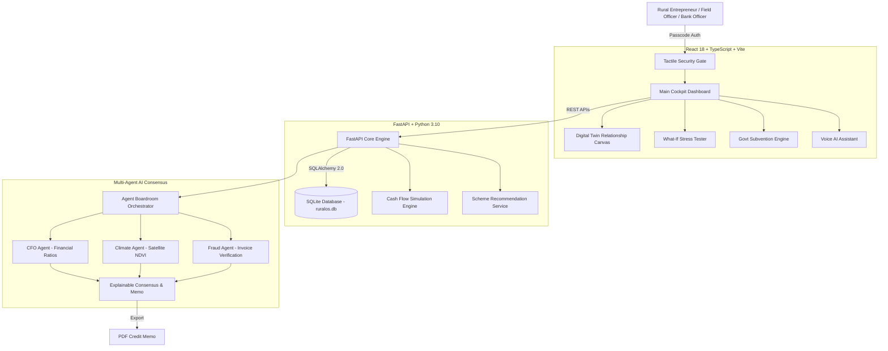

# GramOS — AI-Powered Rural Financial Intelligence & Credit Platform

> **Developed for the NABARD Hackathon (National Bank for Agriculture and Rural Development)**  
> *Closing India's ₹8.5 Lakh Crore Rural Credit Gap through Alternative Credit Underwriting, Satellite Telemetry, and Explainable AI Multi-Agent Consensus.*

---

## 📌 Project Overview

**GramOS** (RuralOS) is a state-of-the-art, AI-driven rural financial operating system designed to transform rural credit underwriting in India. Traditional institutional lending often leaves smallholder farmers, dairy operators, Self-Help Groups (SHGs), and Farmer Producer Organizations (FPOs) unbanked due to lack of formal credit histories, seasonal cash flow volatility, and high administrative overhead.

GramOS solves this challenge by building a dynamic **Financial Digital Twin** using alternative data metrics—including milk cooperative ledger entries, satellite vegetation greenness indices (NDVI), transactions, and Mandi commodity pricing. An **explainable AI Multi-Agent Boardroom** then stress-tests and debates applicant risk, reducing underwriting turnaround time from **45 days to under 10 minutes** while projecting default rates under **2.8%**.

---

## 🏆 Developed for NABARD Hackathon

NABARD's core mission is promoting sustainable and equitable agriculture and rural development through effective credit support and institutional development. GramOS directly aligns with NABARD’s goals:

- **Empowering Unbanked Farmers & Rural Enterprises**: Converts informal ledger data into bankable digital credit profiles.
- **Automated Scheme & Subvention Matching**: Connects farmers directly with central and state subvention schemes (PMEGP, Mudra, AHIDF, KCC).
- **Risk-Mitigated Rural Lending**: Empowers NABARD Field Officers and Bank Credit Officers with satellite-verified crop health and explainable AI fraud detection.
- **Paperless Appraisal & Field Audits**: Cuts administrative lending costs by 85% with automated PDF Credit Memos.

---

## ✨ Key Features

| Feature | Description |
| :--- | :--- |
| **🤖 AI Boardroom Consensus** | LangGraph-inspired multi-agent debate between specialized **CFO**, **Climate Risk**, and **Fraud Investigator** agents for transparent, explainable credit decisions. |
| **🌾 Financial Digital Twin** | Interactive node canvas mapping real-time asset flows, milk/crop production, cash reserves, and outstanding liabilities. |
| **📊 What-If Scenario Tester** | Real-time stress-testing engine allowing users to simulate yield deficits, feed cost spikes, and monsoon delays on multi-month cash flow graphs. |
| **🛰️ NDVI Satellite Climate Watch** | Real-time crop health telemetry using satellite vegetation indices to verify farm yield potential and climate resilience. |
| **🏛️ Govt Subvention Engine** | Automated matching tool scoring eligibility for schemes like PMEGP, Mudra, AHIDF, and NABARD-backed subventions. |
| **🎙️ Voice AI Assistant** | Voice-activated conversational interface supporting local dialects for users with limited digital/keyboard literacy. |
| **📄 Paperless Credit Memo Export** | One-click generation of formal bank appraisal memos ready for institutional credit committees. |
| **⚡ Keyboard Fast Navigation** | Cockpit-style global hotkeys for lightning-fast view switching during field audits. |

---

## 🔑 Passcode Role Access (Demo Credentials)

GramOS features a secure, role-based tactile gate interface. Enter the following passcodes at startup:

- **`7777`** — **Bank Credit Officer View** (Access to AI Boardroom debates, risk radars, and Credit Memo exports)
- **`8888`** — **NABARD Field Inspector View** (Access to document OCR vault, NDVI satellite maps, and anomaly logs)
- **`2026`** — **Developer / Admin View** (Full system access and data configuration)

---

## ⌨️ Keyboard Fast Navigation

- **`[D]`** — Main Dashboard Overview & Financial DNA
- **`[T]`** — Digital Twin Relationship Canvas
- **`[S]`** — What-If Cash Flow Stress Simulator
- **`[G]`** — Government Subvention Schemes Engine

---

## 🏗️ System Architecture



---

## 🛠️ Technology Stack

### **Frontend**
- **Framework**: React 18, TypeScript, Vite
- **Styling**: Vanilla CSS, Tailwind CSS, Glassmorphic UI System
- **Visualizations**: Recharts, Lucide React Icons
- **Animation & Motion**: Framer Motion

### **Backend**
- **Framework**: FastAPI (Python 3.10+)
- **ORM & DB**: SQLAlchemy 2.0, SQLite (`ruralos.db`)
- **Server**: Uvicorn ASGI Server
- **Data Pipelines**: Pydantic v2 data validation schemas

### **AI & Machine Learning**
- **Multi-Agent Debates**: LangGraph-based consensus pipeline (CFO, Climate, Fraud agents)
- **Risk Underwriting**: Alternative credit scoring & SHAP feature explainability
- **Voice AI**: Speech recognition & local-language intent parser

---

## 🚀 Getting Started & Installation

### Prerequisites
- **Node.js**: v18.0.0 or higher
- **npm**: v9.0.0 or higher
- **Python**: v3.10 or higher

---

### 1. Clone the Repository
```bash
git clone https://github.com/Sudhanshu-1729/GramOS..git
cd GramOS
```

---

### 2. Frontend Setup
```bash
# Install frontend dependencies
npm install

# Start the Vite development server
npm run dev
```
The frontend app will be running at `http://localhost:5173`.

---

### 3. Backend Setup
```bash
# Navigate to the backend directory or run from root
cd backend

# Create a virtual environment (optional but recommended)
python -m venv venv
# On Windows:
venv\Scripts\activate
# On macOS/Linux:
source venv/bin/activate

# Install backend dependencies
pip install -r requirements.txt

# Start the FastAPI backend server
python run.py
```
The backend API server will be live at `http://127.0.0.1:8000`. Interactive API documentation (Swagger UI) is available at `http://127.0.0.1:8000/docs`.

---

## 📡 Key API Endpoints

- **`GET /api/v1/business/{id}`** — Fetch business profile & operational metrics.
- **`GET /api/v1/analytics/{id}/twin`** — Retrieve Financial Digital Twin nodes & risk parameters.
- **`POST /api/v1/analytics/{id}/simulate`** — Compute real-time cash flow projections under custom stress variables.
- **`POST /api/v1/analytics/{id}/boardroom`** — Trigger the Multi-Agent AI debate and generate risk consensus.
- **`GET /api/v1/business/{id}/schemes`** — Get matched government subvention schemes.

---

## 📁 Repository Structure

```
GramOS/
├── .env.example              # Sample environment configuration template
├── .gitignore                # Comprehensive git ignore rules (protecting .env & secrets)
├── GRAMOS_MASTER_SPEC.md     # Master specification & architecture document
├── README.md                 # Project documentation
├── index.html                # Vite HTML entry point
├── package.json              # Frontend dependencies and scripts
├── tailwind.config.js        # Design system Tailwind configuration
├── vite.config.ts            # Vite configuration
│
├── src/                      # Frontend Source Code
│   ├── App.tsx               # Main application container & view router
│   ├── main.tsx              # React entry point
│   ├── components/           # Core UI Components
│   │   ├── AiBoardroom.tsx   # Multi-Agent debate boardroom interface
│   │   ├── CreditMemo.tsx    # PDF credit memo generator
│   │   ├── DigitalTwin.tsx   # Visual financial twin graph node canvas
│   │   ├── FinancialDna.tsx  # Radar risk profiling dashboard
│   │   ├── VoiceAi.tsx       # Voice AI assistant side-drawer
│   │   ├── WhatIfSimulator.tsx # Cash flow stress-testing sliders
│   │   └── ui/               # Reusable UI primitives (GlassCard, Button, etc.)
│   ├── services/
│   │   └── api.ts            # REST API service connector
│   └── data/
│       └── mockData.ts       # Fallback mock dataset
│
└── backend/                  # Backend Source Code (FastAPI)
    ├── run.py                # Main application launcher (Uvicorn)
    ├── requirements.txt      # Python dependencies
    └── app/
        ├── main.py           # FastAPI initialization & DB seeding
        ├── config.py         # Application settings
        ├── database.py       # SQLAlchemy engine & session setup
        ├── models.py         # Database ORM models
        ├── api/v1/           # API routes & endpoints
        ├── repositories/     # Database access layer
        ├── schemas/          # Pydantic data schemas
        └── services/         # Business logic & AI agent orchestration
            ├── agent_boardroom_service.py # LangGraph AI debate service
            ├── risk_service.py            # Credit risk engine
            ├── simulation_service.py      # Scenario simulator
            └── voice_service.py           # Voice AI query processing
```

---

## 🔒 Security & Privacy

GramOS strictly adheres to data privacy standards:
- **Environment Isolation**: `.env` and sensitive local configuration files are excluded from source control.
- **Non-Collateral Underwriting**: Financial digital twins operate on permissioned transaction ledgers without requiring land titles.
- **Explainable Predictions**: AI agents provide transparent reasoning rather than black-box automated denials.

---

## 📜 License & Acknowledgements

Created for the **NABARD Hackathon**. Built to empower millions of unbanked rural entrepreneurs and farmers across India.

*For inquiries or demonstration requests, please refer to the project specification in [`GRAMOS_MASTER_SPEC.md`](file:///d:/GramOS/GRAMOS_MASTER_SPEC.md).*
