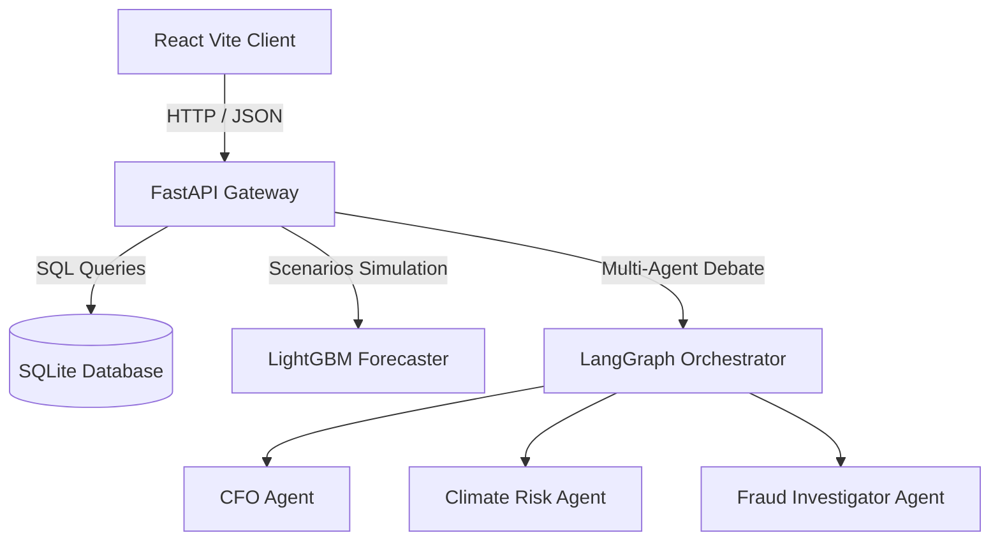
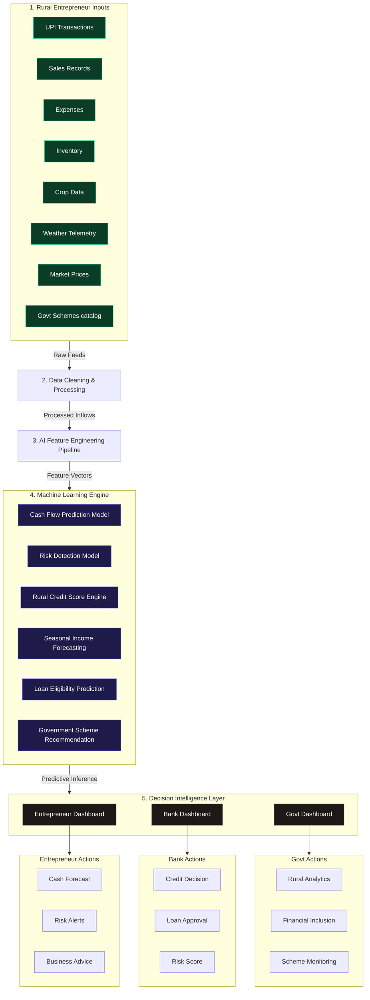

# System Architecture Document - RuralOS

## 1. Technical Architecture Overview
RuralOS is architected as a decoupled client-server platform optimized for high data density, low-latency client-side rendering, and robust fail-safe operations.



---

## 2. Platform Data Pipeline & Engine Flow
This model maps the transition from raw inputs to ML intelligence predictions, showing the endpoints loaded in the dashboards:



### Raw Data Flow Schematic
```text
                 Rural Entrepreneur
                         │
                         ▼
          Financial & Business Data Collection
──────────────────────────────────────────────────
• UPI Transactions
• Sales Records
• Expenses
• Inventory
• Crop Data
• Weather
• Market Prices
• Government Schemes
──────────────────────────────────────────────────
                         │
                         ▼
               Data Cleaning & Processing
                         │
                         ▼
          AI Feature Engineering Pipeline
                         │
                         ▼
──────────────────────────────────────────────────
           Machine Learning Engine
──────────────────────────────────────────────────
│ Cash Flow Prediction Model                  │
│ Risk Detection Model                        │
│ Rural Credit Score Engine                   │
│ Seasonal Income Forecasting                 │
│ Loan Eligibility Prediction                 │
│ Government Scheme Recommendation            │
──────────────────────────────────────────────────
                         │
                         ▼
               Decision Intelligence Layer
                         │
        ┌────────────────┼────────────────┐
        ▼                ▼                ▼
 Entrepreneur Dashboard  Bank Dashboard  Govt Dashboard
        │                │                │
        ▼                ▼                ▼
Cash Forecast      Credit Decision   Rural Analytics
Risk Alerts        Loan Approval     Financial Inclusion
Business Advice    Risk Score        Scheme Monitoring
```

---

## 3. Component Blueprint

### A. React Frontend Core (`src/`)
* **Framework**: React 18, Vite 8, TypeScript.
* **Styling**: TailwindCSS 4, Custom Glassmorphism, CRED glows.
* **Charts**: Recharts (Radar, Area, Bar, Custom Gauges).
* **Interactions**: Framer Motion, keyboard hotkeys event handlers.

### B. FastAPI Backend Core (`backend/`)
* **Endpoint Router**: Direct REST API routes for simulation models, PDF memos, and courtroom consensus debates.
* **Database Layer**: SQLite engine storing credit profiles, transaction ledgers, and early warning notifications.
* **Agents Framework**: Independent LangGraph node agents analyzing credit and drought alerts:
  * **CFO Agent**: Evaluates debt-service coverage ratio (DSCR).
  * **Climate Agent**: Monitors NDVI satellite indexes and moisture stress.
  * **Fraud Agent**: Runs anomaly audits on uploaded ledger PDF invoices.

---

## 4. Database Schema Blueprint
* **`businesses`**: Profile ID, name, sector, location, baseline score, assets, outstanding loans.
* **`transactions`**: Credit/debit logs, cooperative milk payments, invoice uploads.
* **`early_warnings`**: Deficit triggers, price changes, local drought warnings.
